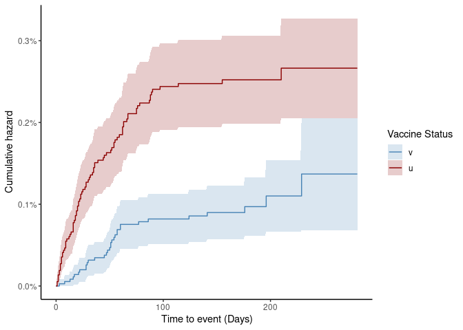
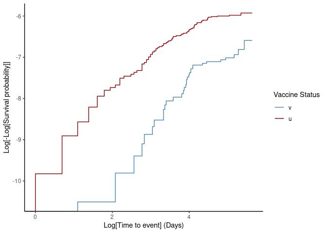

# Use case

``` r
library("vaccineff")
library("ggplot2")
library("cowplot")
data(cohortdata)
head(cohortdata)
```

    ##         id sex age death_date death_other_causes vaccine_date_1 vaccine_date_2
    ## 1 afade1b2   F  37       <NA>               <NA>           <NA>           <NA>
    ## 2 556c8c76   M  19       <NA>               <NA>           <NA>           <NA>
    ## 3 04edf85a   M  50       <NA>               <NA>           <NA>           <NA>
    ## 4 7e51a18e   F   8       <NA>               <NA>           <NA>           <NA>
    ## 5 c5a83f56   M  66       <NA>               <NA>           <NA>           <NA>
    ## 6 7f675ec3   M  29       <NA>               <NA>     2044-04-09     2044-04-30
    ##   vaccine_1 vaccine_2
    ## 1      <NA>      <NA>
    ## 2      <NA>      <NA>
    ## 3      <NA>      <NA>
    ## 4      <NA>      <NA>
    ## 5      <NA>      <NA>
    ## 6    BRAND1    BRAND1

## Data preparation

-   End date defined for the study:

``` r
end_cohort <- as.Date("2044-12-31")
```

-   Dose selected for the analysis: `date_vaccine_2`

``` r
vacc_date_col <- "vaccine_date_2"
```

-   Immunization delay given by time to protecting effect: `14 days`

``` r
immunization_delay <- 14
```

-   Outcome selected for the analysis

``` r
outcome <- "death_date"
```

-   Construct immunization date for every register based on previous
    definitions

``` r
cohortdata$immunization <-
  get_immunization_date(
    data = cohortdata,
    outcome_date_col = outcome,
    outcome_delay = 0,
    immunization_delay = immunization_delay,
    vacc_date_col = vacc_date_col,
    end_cohort = end_cohort,
    take_first = FALSE)
```

-   Beginning of follow-up period is defined based on the minimum
    immunization date of the cohort

``` r
start_cohort <- as.Date(min(cohortdata$immunization, na.rm = TRUE))
```

-   Add vaccine status

``` r
cohortdata$vaccine_status <- set_status(
  data = cohortdata,
  col_names = "immunization",
  status = c("v", "u")
)
```

## Matching population

``` r
matched_cohort <- match_cohort(data = cohortdata,
  status_vacc_col = "vaccine_status",
  nearest = c(age = 1)
)

head(matched_cohort[order(matched_cohort$subclass), ], n = 4)
```

    ##             id sex age death_date death_other_causes vaccine_date_1
    ## 10    f7e9191f   F  34       <NA>               <NA>     2044-04-21
    ## 28938 22be66b8   M  32       <NA>               <NA>           <NA>
    ## 10001 77e132b3   M  53       <NA>               <NA>     2044-06-13
    ## 71426 d6b8f6a9   M  42       <NA>               <NA>           <NA>
    ##       vaccine_date_2 vaccine_1 vaccine_2 immunization vaccine_status prop_score
    ## 10        2044-05-12    BRAND1    BRAND1   2044-05-26              v  0.3244989
    ## 28938           <NA>      <NA>      <NA>         <NA>              u  0.3069741
    ## 10001     2044-07-04    BRAND1    BRAND1   2044-07-18              v  0.5093923
    ## 71426           <NA>      <NA>      <NA>         <NA>              u  0.3992364
    ##       subclass
    ## 10           1
    ## 28938        1
    ## 10001        2
    ## 71426        2

The couples with one or both members having a censoring date must be
completely censored. To do it, the minimum censoring date between the
two members is imputed to both of them. Imputation occurs only if the
date to be imputed is lower than the outcome date of each member.

``` r
censoring_date <- "death_other_causes"
matched_cohort$censoring_date <-  get_censoring_date_match(
  data = matched_cohort,
  outcome_date_col = "death_date",
  censoring_date_col = censoring_date
)
```

### FUNCTION TO MATCH INFORMATION BETWEEN COUPLES

Other information must be imputed to partners. The following function
was designed to impute the minimum value of a given variable to each
couple

``` r
match_info <- function(data,
                       info_to_match) {
  matched_info <- unlist(
    tapply(data[[info_to_match]],
      data$subclass,
      function(x) {
        if (all(is.na(x))) {
          return(NA)
        } else {
          return(as.character(min(x, na.rm = TRUE)))
        }
      }
    )
  )
  # return data matched by subclass
  return(matched_info[data$subclass])
}
```

### Time-to-event and beginning of follow-up period

The beginning of the follow-up period of every couple must be the
immunization date of the vaccinated member.

``` r
matched_cohort$t0_fu <- as.Date(match_info(data = matched_cohort,
  info_to_match = "immunization"
))
```

Time-to-event is calculated starting from the beginning of the follow-up
period of each couple.

``` r
matched_cohort$time_to_death <- get_time_to_event(
  data = matched_cohort,
  outcome_date_col = "death_date",
  censoring_date_col = "censoring_date",
  start_cohort = start_cohort,
  end_cohort = end_cohort,
  start_from_immunization = TRUE,
  immunization_date_col = "t0_fu"
)
```

The matched strategy is not rolling-calendar. This generates matches
between individuals that could present an outcome before the
immunization date of their match. A first strategy to solve this is
removing the problematic matches. To do this it is necessary to match
the negative time to event for every couple.

``` r
matched_cohort$matched_time <- match_info(data = matched_cohort,
  info_to_match = "time_to_death"
)
neg_times <- matched_cohort[matched_cohort$matched_time < 0, ]

head(neg_times[order(neg_times$subclass), ], n = 4)
```

    ##             id sex age death_date death_other_causes vaccine_date_1
    ## 10206 cd3b25cf   F  80       <NA>               <NA>     2044-03-19
    ## 93603 b654fd55   M  76 2044-04-29               <NA>           <NA>
    ## 1050  99e72fa2   F  39       <NA>               <NA>     2044-07-27
    ## 39380 58794ab7   F  34       <NA>         2044-08-08           <NA>
    ##       vaccine_date_2 vaccine_1 vaccine_2 immunization vaccine_status prop_score
    ## 10206     2044-05-01    BRAND2    BRAND2   2044-05-15              v  0.7563634
    ## 93603           <NA>      <NA>      <NA>         <NA>              u  0.7252355
    ## 1050      2044-11-18    BRAND2    BRAND2   2044-12-02              v  0.3704365
    ## 39380           <NA>      <NA>      <NA>         <NA>              u  0.3244989
    ##       subclass censoring_date      t0_fu time_to_death matched_time
    ## 10206       81           <NA> 2044-05-15           230          -16
    ## 93603       81           <NA> 2044-05-15           -16          -16
    ## 1050       210     2044-08-08 2044-12-02          -116         -116
    ## 39380      210     2044-08-08 2044-12-02          -116         -116

The couples with negative `matched_time` in the previous dataframe are
removed.

``` r
cohort_corrected <- matched_cohort[matched_cohort$matched_time > 0, ]
print(paste0("Number of matched registers: ", nrow(matched_cohort)))
```

    ## [1] "Number of matched registers: 74924"

``` r
print(paste0("Number of registers with correct time-to-event: ", nrow(cohort_corrected)))
```

    ## [1] "Number of registers with correct time-to-event: 74012"

### Outcome Status

The event status is calculated based on the outcome date. For the
registers with censoring date, it is forced to be 0 (negative).

``` r
# set outcome statues
cohort_corrected$death_status <- set_status(
  data = cohort_corrected,
  col_names = outcome
)

cohort_corrected$death_status <- ifelse(
  !is.na(cohort_corrected$censoring_date) &
    !is.na(cohort_corrected$death_date) &
    (cohort_corrected$censoring_date <= cohort_corrected$death_date),
  yes = 0,
  no = cohort_corrected$death_status
)
```

## Estimations

### Survival curve

The survival curve for the matched cohort

``` r
cohort_corrected$vaccine_status <- as.character(cohort_corrected$vaccine_status)

plt <- plot_survival(
  data = cohort_corrected,
  outcome_status_col = "death_status",
  time_to_event_col = "time_to_death",
  vacc_status_col = "vaccine_status",
  vaccinated_status = "v",
  unvaccinated_status = "u",
  vaccinated_color = "steelblue",
  unvaccinated_color = "darkred",
  start_cohort = start_cohort,
  end_cohort = end_cohort,
  percentage = TRUE,
  cumulative = TRUE
)
plt
```



``` r
surv <- plt$data

surv[surv$time == max(surv$time), ]
```

    ##     time n.risk n.event n.censor      surv      cumhaz     std.chaz strata
    ## 282  281    125       0      123 0.9973356 0.002667872 0.0003113575      u
    ## 564  281    125       0      123 0.9986304 0.001370489 0.0003500818      v
    ##      type logse conf.int conf.type     lower     upper       date        plot
    ## 282 right  TRUE     0.95       log 0.9967271 0.9979444 2044-12-30 0.002664396
    ## 564 right  TRUE     0.95       log 0.9979453 0.9993159 2044-12-30 0.001369615
    ##       plot_lower  plot_upper
    ## 282 0.0020555641 0.003272856
    ## 564 0.0006841072 0.002054653

``` r
1-(0.001370489/0.002667872)
```

    ## [1] 0.4862988

The proportional hazards is checked by means of the loglog curve using
the information from the survival curve

``` r
surv$loglog <- log(-log(surv$surv))

surv$logtime <- log(surv$time)
plt_loglog <- ggplot(data = surv) +
geom_step(ggplot2::aes(x = .data$logtime,
                       y = .data$loglog,
                       color = .data$strata)
  ) +
  theme_classic() +
  labs(x = "Log[Time to event] (Days)",
       y = "Log[-Log[Survival probability]]") +
  labs(colour = "Vaccine Status") +
  scale_color_manual(
    name = "Vaccine Status",
    values = c("steelblue", "darkred"),
    labels = c("v", "u")
  )
plt_loglog
```



### Cox Model

``` r
p_thr <- 0.05

cx <- survival::coxph(  # nolint
  survival::Surv(time_to_death, death_status) ~
    vaccine_status , data = cohort_corrected
)

# Test the Proportional Hazards Assumption
test <- survival::cox.zph(cx)
hr <- round(exp(stats::coef(cx)), digits = 4)

# extract first and second element as limits
ci025 <- round(exp(stats::confint(cx)), 4)[1]
ci975 <- round(exp(stats::confint(cx)), 4)[2]

p <- test$table["GLOBAL", "p"]

if (p < p_thr) {
  ph <- "reject"
} else {
  ph <- "accept"
}
df_summ <- data.frame(
  HR = hr,
  HR_low = ci025,
  HR_high = ci975,
  V_eff = 1 - hr,
  V_eff_low = 1 - ci975,
  V_eff_high = 1 - ci025,
  PH = ph,
  p_value = p # p_value must be a numeric
)

print(df_summ)
```

    ##                    HR HR_low HR_high V_eff V_eff_low V_eff_high     PH
    ## vaccine_statusv 0.376 0.2504  0.5646 0.624    0.4354     0.7496 reject
    ##                   p_value
    ## vaccine_statusv 0.0182162

Including the prop_score in the regression blows the upper value of the
CI. Additionally, it over-estimates the effectiveness and keeps the same
the p-value. It is not adding any level of accuracy to the model.

``` r
p_thr <- 0.05

cx <- survival::coxph(  # nolint
  survival::Surv(time_to_death, death_status) ~
    vaccine_status + prop_score, data = cohort_corrected
)

# Test the Proportional Hazards Assumption
test <- survival::cox.zph(cx)
hr <- round(exp(stats::coef(cx)), digits = 4)

# extract first and second element as limits
ci025 <- round(exp(stats::confint(cx)), 4)[1]
ci975 <- round(exp(stats::confint(cx)), 4)[2]

p <- test$table["GLOBAL", "p"]

if (p < p_thr) {
  ph <- "reject"
} else {
  ph <- "accept"
}
df_summ <- data.frame(
  HR = hr,
  HR_low = ci025,
  HR_high = ci975,
  V_eff = 1 - hr,
  V_eff_low = 1 - ci975,
  V_eff_high = 1 - ci025,
  PH = ph,
  p_value = p # p_value must be a numeric
)

print(df_summ)
```

    ##                         HR HR_low  HR_high       V_eff V_eff_low V_eff_high
    ## vaccine_statusv     0.2484 0.1654 9524.635      0.7516 -9523.635     0.8346
    ## prop_score      40553.6177 0.1654 9524.635 -40552.6177 -9523.635     0.8346
    ##                     PH     p_value
    ## vaccine_statusv reject 0.002473514
    ## prop_score      reject 0.002473514
